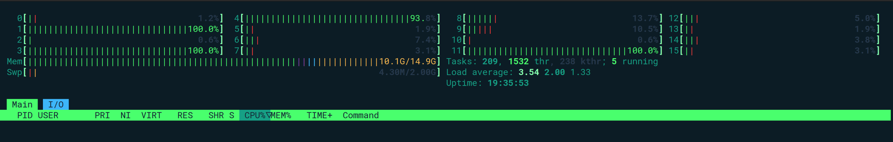
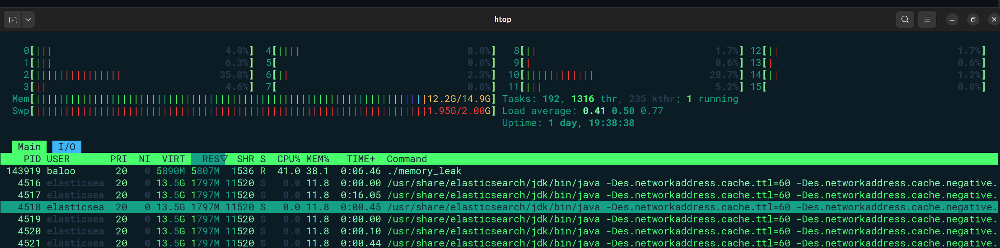
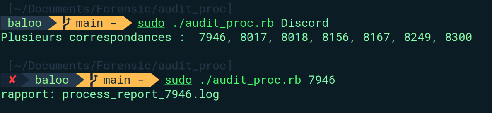
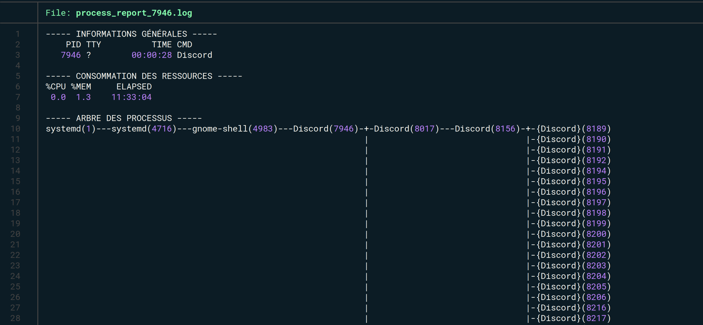
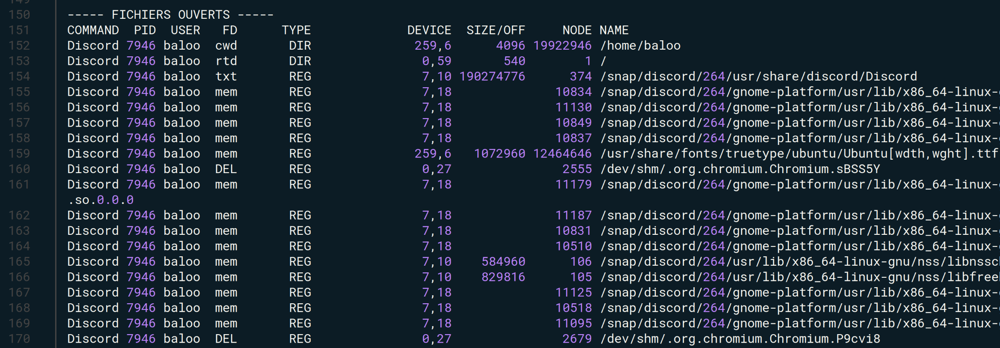
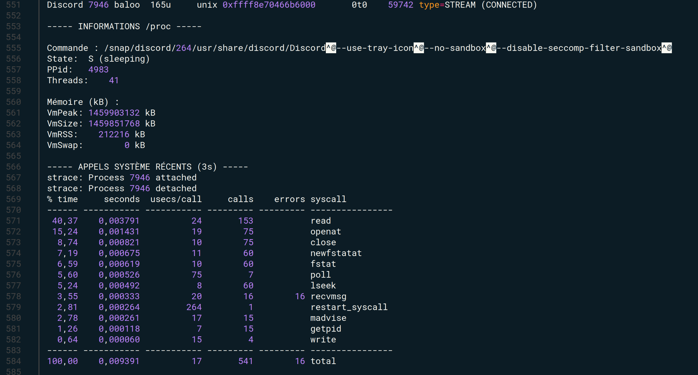

# Analyse Forensique et Débogage Système

## Analyse de processus et performances

### 1. Localisation des ressources

* **Scénarios de test :** Accessibles dans le dossier `proc_perf_diag/scenario`.
* **Guide méthodologique :** Le fichier `proc_perf_diag/Methodology.md` décrit les étapes d'implémentation et les indicateurs d'observation.

---

### 2. Analyse opérationnelle des scénarios

#### 2.1 La boucle infinie (`infinite_loop`)

**Observation initiale :**
Pour vérifier l'état du processus, on utilise `ps aux` :

```bash
ps aux | awk 'NR==1 || /infinite_loop/'

```

* **En exécution :** Le processus affiche le statut **R (Running)** et une utilisation CPU de **100%**.
* **À l'arrêt :** Le processus disparaît immédiatement de la table des processus.

**Problématique :** Pourquoi le système ne crache-t-il pas malgré un CPU à 100% ?
L'outil `htop` permet de visualiser la répartition sur les cœurs :

```bash
htop -p $(pgrep infinite_loop)

```


**Analyse de la charge :**

* Sur une configuration à **16 cœurs**, une instance à 100% ne représente que **6,25%** de la capacité totale.
* En lançant 4 instances, on mobilise 4 cœurs (soit 25% du total). Le système reste fluide car il dispose de 12 cœurs libres pour les autres tâches.

> **Le risque de la "Fork Bomb" :** > Contrairement à une boucle simple, une Fork Bomb se réplique de manière exponentielle. Elle sature la totalité des cœurs et la table des processus, provoquant un gel (**freeze**) complet de la machine.
C’est une excellente intuition. Dans un rapport de forensique, comprendre la différence entre un processus qui "consomme" (CPU Bound) et un processus qui "attend" (I/O ou Timer Bound) est fondamental.

Voici comment intégrer cette analyse à ta section 2.1, en gardant ton style :

---

### 2.1.1 Variantes de la boucle : Consommation vs Attente

**Problématique :** Pourquoi une boucle consomme-t-elle 100% d'un cœur et comment détecter une boucle "silencieuse" ?

#### A. La boucle "CPU-Bound" (sans sleep)

Par défaut, le processus `infinite_loop` tente d'exécuter ses instructions le plus vite possible. Le noyau lui alloue toutes les ressources du cœur disponible car le processus ne rend jamais la main.

* **Observation `strace` :** La sortie est vide.

```bash
sudo strace -p $(pgrep infinite_loop)
# strace: Process 141416 attached
# (Rien ne s'affiche jusqu'au Ctrl+C)

```

* **Analyse :** L'absence de sortie dans `strace` signifie que le processus ne fait aucun **appel système** (syscall). Il reste dans l'espace utilisateur ("User Space"), bouclant sur des calculs internes. C'est pour cela qu'il s'accapare 100% du CPU.

#### B. La boucle "Timer-Bound" (avec sleep)

Si l'on ajoute une instruction `sleep()`, le comportement change radicalement. Le CPU chute à **0%**.

* **Observation `strace` :** On voit le processus interagir avec le noyau.

```bash
sudo strace -p $(pgrep infinite_loop)
# clock_nanosleep(CLOCK_REALTIME, 0, {tv_sec=2, tv_nsec=0}, ...) = 0

```

* **Analyse :** Ici, le processus dit explicitement au noyau : *"Endors-moi pendant 2 secondes"*. Le planificateur (scheduler) du noyau retire le processus du CPU et le place en état **S (Sleep)**.
* **Détection forensique :** Même si le CPU est à 0%, `strace` révèle la boucle infinie en montrant la répétition incessante de l'appel `clock_nanosleep`. Le processus n'est pas "mort", il est juste en attente cyclique.

---

#### 2.2 Blocage I/O (`IO_blocking`)

Le programme est en attente d'une interaction utilisateur (clavier ou `Ctrl+D`).

**Observation de l'état :**

* **État S (Interruptible Sleep) :** Le processus est en sommeil. Il ne consomme pas de CPU et attend un événement (signal ou entrée réseau/clavier).

**Analyse avec `strace` :**
Pour voir ce qui se passe au niveau du noyau, on suit les appels système :

```bash
sudo strace -p $(pgrep IO_blocking)

```

Le processus se bloque sur : `read(0,` (où `0` est le descripteur de `stdin`).

**Sortie de blocage :**
Lorsqu'on ferme l'entrée (Ctrl+D) :

```plaintext
read(0, "", 1024) = 0
exit_group(0)     = ?
+++ exited with 0 +++

```

* `read(...) = 0` : Indique la fin de fichier (**EOF**).
* `exit_group(0)` : Terminaison propre du programme.

---

#### 2.3 La fuite mémoire (`memory_leak`)

**Définition :** Mémoire réservée par un programme, devenue inaccessible mais non rendue au système.

**Les 3 caractéristiques d'une fuite :**

1. **L'occupation :** Réservation de RAM auprès de l'OS.
2. **La perte de contrôle :** Perte du pointeur (l'adresse mémoire) ; le programme ne sait plus où est la donnée.
3. **L'oubli de libération :** Absence de l'instruction `free()`.

**Distinction VIRT vs RES :**

* **VIRT (Mémoire Virtuelle) :** La "promesse" faite par le système via `malloc`.
* **RES (Mémoire Résidente) :** La mémoire physique réelle utilisée (activée ici par `memset`).

**Diagnostic avec `htop` :**
En triant par `PERCENT_MEM` (touche `F6`), on observe la colonne `RES` augmenter de **256 Mo** à chaque itération.



> **Piège de l'optimisation :** > Avec les flags `-O2` ou `-O3`, le compilateur supprime le `memset` s'il juge que la mémoire n'est jamais relue. La fuite devient alors invisible dans la colonne `RES`. Il faut compiler sans optimisation pour les tests.

**Protection du noyau (OOM Killer) :**
Via `strace`, on voit l'appel `mmap` (segment de  octets). Lorsque la RAM est saturée (ex: 6.75 GB), le noyau déclenche le **OOM Killer**.

* **Résultat :** `+++ killed by SIGKILL +++`. Le système sacrifie le processus pour survivre.

**Conséquences majeures :**

* **Thrashing :** Ralentissement extrême dû au passage incessant entre RAM et Swap (disque).
* **Instabilité :** Les autres applications ne peuvent plus allouer de mémoire et plantent.
* **Crash :** Arrêt brutal du service (critique en production).

---

### 2.4 Le processus Zombie (`zombie_process`) 

**Observation concrète :**
Le lancement du binaire `./zombie_process` génère une structure hiérarchique composée d'un processus parent et de 5 processus fils.

**Identification des PIDs :**
L'outil `pgrep` liste les identifiants uniques alloués par le noyau :

```bash
pgrep zombie_process
# Sortie : 
128042 (Parent)
128043
128044
128045
128046
128047

```

**Analyse de la hiérarchie et des états :**
L'exécution de `pstree` confirme la filiation directe :

```bash
pstree 128042
# Résultat : zombie_process───5*[zombie_process]

```

L'état des processus dans la table `ps` montre que les 5 fils sont en statut **Z (Zombie)**, tandis que le parent est en statut **S (Sleep)**.

**Diagnostic par traçage système (`strace`) :**
L'analyse de l'activité du parent (PID 128042) via `strace` identifie la cause du blocage :

```bash
sudo strace -p 128042
# Sortie : strace: Process 128042 attached
#          restart_syscall(<... resuming interrupted read ...>

```

Le processus parent est suspendu sur un appel système de lecture (`read`). Il est en attente d'une interaction sur l'entrée standard avant de poursuivre son exécution. Tant que cet appel n'est pas complété, le parent ne peut pas exécuter l'instruction `wait()` nécessaire pour "récolter" le statut de sortie des fils et les libérer de la table des processus.

**Cycle de terminaison :**

1. **Phase de rétention :** Les fils ont terminé leur exécution (`exit`), mais leurs descripteurs restent inscrits dans la table des processus car le parent est occupé par son `syscall`.
2. **Reprise et Nettoyage :** À la clôture du processus parent, le noyau réattribue les zombies au processus `init` (PID 1) qui procède immédiatement à leur suppression définitive.

---

### 2.5 Le danger critique : Saturation du `pid_max`

Bien qu'un processus zombie ne consomme plus de ressources CPU ou RAM, il demeure une menace pour la stabilité du système en raison de la gestion des identifiants (PIDs).

* **Mécanisme :** Chaque processus, même mort (zombie), occupe un emplacement dans la **table des processus** du noyau pour conserver son code de sortie.
* **Limite système :** Le nombre total de PIDs est fini. Cette limite est définie dans le fichier `/proc/sys/kernel/pid_max`.
* **Conséquence d'une prolifération :** Si une application défaillante génère des milliers de zombies sans jamais les récolter, elle finit par atteindre la limite `pid_max`.

> **Impact opérationnel :** Une fois la table saturée, le noyau est incapable d'allouer de nouveaux PIDs. Le système ne peut plus lancer aucune commande (`ls`, `ps`, `sh`), rendant toute intervention technique impossible sans un redémarrage matériel ou l'arrêt forcé du processus parent fautif.

---

### 2.6 Le processus stoppé (`stopped_process`)

**Observation du comportement :**
Le binaire `./stopped_process` simule un état de suspension volontaire. À l'exécution, le programme s'interrompt de lui-même après avoir affiché ses informations de contrôle.

**Analyse de l'état via `ps` :**
L'examen de la table des processus montre deux états distincts selon le moment de l'observation :

```bash
baloo     112485  0.0  0.0   2680  1536 pts/3    T    16:37   0:00 ./stopped_process
baloo     112748  0.0  0.0   2680  1536 pts/3    S+   16:38   0:00 ./stopped_process

```

* **État T (Stopped) :** Le processus est suspendu. Il est toujours présent en mémoire mais le kernel ne lui alloue plus de temps CPU.
* **État S+ (Interruptible Sleep) :** Le processus est en attente d'un événement au premier plan (foreground).

**Interactions utilisateur et signaux :**
Dans un usage quotidien, cet état **T** est généralement provoqué manuellement par l'utilisateur via la combinaison de touches **`Ctrl+Z`** (envoie le signal `SIGTSTP`).

La gestion de ces processus suspendus s'effectue avec les commandes de contrôle de job :

* **`jobs`** : Liste les processus stoppés dans le shell courant.
* **`fg` (Foreground)** : Reprend l'exécution du processus au premier plan.
* **`bg` (Background)** : Reprend l'exécution en arrière-plan.
* **`kill -CONT <PID>`** : Envoie le signal de continuation au niveau du noyau, indépendamment du shell.

**Analyse de la terminaison avec `strace` :**
L'utilisation de `strace` lors de l'arrêt forcé du processus (via `kill -TERM`) révèle la réception du signal par le noyau :

```bash
sudo strace -p 129889
# Sortie :
# restart_syscall(<... resuming interrupted read ...>) = ? ERESTART_RESTARTBLOCK (Interrupted by signal)
# --- SIGTERM {si_signo=SIGTERM, si_code=SI_USER, si_pid=130300, si_uid=1000} ---
# +++ killed by SIGTERM +++

```

**Décryptage de la trace :**

1. **`RESTART_RESTARTBLOCK`** : Le processus était initialement bloqué sur un appel système (`read`). Le noyau tente de redémarrer cet appel après une interruption.
2. **`SIGTERM`** : On identifie ici la source de l'arrêt. Le champ `si_pid=130300` indique précisément quel processus a envoyé l'ordre de fermeture, et `si_uid=1000` confirme qu'il s'agit de l'utilisateur (baloo).
3. **`killed by SIGTERM`** : Le processus ne traite pas le signal lui-même (pas de gestionnaire d'exception) ; c'est le noyau qui met fin au processus de manière propre.

Voici la suite de ton rapport, intégrant l'analyse technique du code source et les résultats de tes investigations avec `lsof` et `strace`.

---

### 2.7 Sommeil ininterruptible (`disk_sleep`)

**Observation du comportement :**
Le binaire `./disk_sleep` simule un état de sommeil ininterruptible (**état D**), un état critique où le processus attend une réponse matérielle (généralement du stockage) et ne peut pas être interrompu par des signaux, même par un `kill -9`.

**Analyse du mécanisme (Code Source) :**
Pour forcer cet état, le programme utilise trois leviers de synchronisation I/O :

1. **`O_SYNC`** : Le fichier est ouvert de manière à ce que chaque écriture soit immédiatement écrite sur le disque physique.
2. **`write()` de 1 MB** : Des blocs de données conséquents sont envoyés pour saturer le cache.
3. **`sync()` et `fsync()**` : Ces appels forcent le noyau à vider tous les buffers vers le matériel, mettant le processus en attente directe du contrôleur de disque.

**Diagnostic de l'état via `watch` et `ps` :**
L'observation en temps réel montre une alternance rapide :

* **État S (Interruptible Sleep)** : Le processus attend durant le `usleep(100000)`.
* **État D (Uninterruptible Sleep)** : Durant les appels `sync()` et `fsync()`, le processus bascule brièvement en état **D**. Si le disque était plus lent (ou un montage réseau NFS instable), le processus resterait figé en **D**.

**Analyse des fichiers ouverts (`lsof`) :**
La commande `lsof` permet d'identifier la cible des écritures :

```bash
COMMAND     PID   USER   FD   TYPE DEVICE  SIZE/OFF      NODE NAME
disk_slee 137912 baloo   3w   REG  259,6 285212672 23855125 /tmp/disk_sleep_test.dat

```

On constate que le File Descriptor **3w** (Write) pointe vers `/tmp/disk_sleep_test.dat`. La taille (`SIZE/OFF`) augmente rapidement à chaque itération, confirmant le flux d'écriture massif.

**Traçage des appels système (`strace`) :**
Le traçage spécifique des appels I/O confirme la boucle infinie de synchronisation :

```bash
sudo strace -p 137912 -e trace=write,sync,fsync
# Sortie :
# write(3, "DDDD...", 1048576) = 1048576
# sync()                        = 0
# fsync(3)                      = 0

```

Chaque cycle garantit que la donnée a quitté la RAM pour le stockage physique. C'est durant l'exécution de `sync()` que le processus est considéré par le noyau comme "non interruptible" afin d'éviter toute corruption de données.

> **Risque Forensique (Processus "Incassable") :** Un processus bloqué en état **D** de façon prolongée est souvent le signe d'une défaillance matérielle (disque défectueux) ou d'un problème réseau (partage NFS déconnecté). Comme il ignore les signaux, il ne peut pas être tué. Une accumulation de processus en état **D** fait monter la **Load Average** de manière artificielle et peut mener au gel complet du système.

---

### 3. Tableau Récapitulatif des États de Processus Observés

| État | Désignation | Observation via Outils | Cause dans nos scénarios |
| --- | --- | --- | --- |
| **R** | Running | `htop` (100% CPU) | Boucle infinie (`infinite_loop`) |
| **S** | Interruptible Sleep | `strace` (bloqué sur `read`) | Attente I/O ou `sleep` (`IO_blocking`) |
| **T** | Stopped | `ps` (STAT T) | Signal `SIGTSTP` ou Ctrl+Z (`stopped_process`) |
| **Z** | Zombie | `pstree` (5*[zombie_process]) | Parent n'ayant pas fait de `wait()` |
| **D** | Uninterruptible Sleep | `ps` (alternance S/D) | Écritures synchrones forcées (`disk_sleep`) |

---

### 4. Script ruby générant un rapport d'analyse de processus :

Script disponible dans le dossier `proc_perf_diag/audit_proc/audit_proc.rb`.

#### Captures d'écrans: exemple d'utulisation du script : 






---
## Diagnostic Réseau

### Scénarios de diagnostic

1. **[Service Web Inaccessible](audit_network/scenario/scenario1-service-inaccessible.md)**
   - Service en cours d'exécution mais inaccessible
   - Problèmes de configuration réseau
   - Pare-feu bloquant localement
   - Outils : `ss`, `netstat`, `ip`, `iptables`, `nmap`, `tcpdump`

2. **[Latence Réseau Élevée](audit_network/scenario/scenario2-latence-elevee.md)**
   - Temps de réponse élevés
   - Goulots d'étranglement réseau
   - Problèmes de routage
   - Outils : `ping`, `traceroute`, `mtr`, `ss`, `tcpdump`

3. **[Résolution DNS Défaillante](audit_network/scenario/scenario3-dns-defaillant.md)**
   - Échec de résolution de noms
   - Lenteur DNS
   - Problèmes de configuration
   - Outils : `dig`, `nslookup`, `host`, `resolvectl`, `tcpdump`

4. **[Pare-feu Bloquant](audit_network/scenario/scenario4-pare-feu-bloquant.md)**
   - Connexions bloquées par iptables/firewalld/ufw
   - Identification des règles problématiques
   - Configuration sécurisée
   - Outils : `iptables`, `firewalld`, `ufw`, `nmap`, `tcpdump`

## Outils de diagnostic couverts

### Analyse des sockets et connexions
- **ss** : état des sockets, connexions actives, statistiques TCP
- **netstat** : alternative legacy à ss

### Configuration réseau
- **ip** : interfaces, adresses IP, routage, voisinage
- **ifconfig** : legacy (remplacé par ip)

### Capture et analyse du trafic
- **tcpdump** : capture de paquets, filtrage, analyse réseau

### Scan et découverte
- **nmap** : scan de ports, détection de services, identification OS
- **nc** (netcat) : tests de connectivité basiques

### Latence et routage
- **ping** : latence ICMP de base
- **traceroute** : traçage du chemin réseau
- **mtr** : traceroute continu avec statistiques

### DNS
- **dig** : requêtes DNS détaillées
- **nslookup** : résolution simple
- **host** : résolution rapide
- **resolvectl** : gestion systemd-resolved

### Pare-feu
- **iptables** : pare-feu Linux traditionnel
- **firewalld** : frontend pour iptables (RHEL/CentOS)
- **ufw** : frontend simple (Ubuntu/Debian)
- **nft** : nftables, remplaçant moderne d'iptables

## Structure de chaque scénario

Chaque fichier de scénario contient :

1. **Description du problème** : symptômes et contexte
2. **Démarche de diagnostic complète** : étapes méthodiques
3. **Commandes détaillées** : syntaxe et options
4. **Interprétation des résultats** : comprendre les sorties
7. **Scripts de diagnostic** : automatisation

## Utilisation

### Diagnostic rapide

Pour chaque problème, suivre les étapes dans l'ordre :

1. Identifier les symptômes
2. Vérifier la configuration de base
3. Tester localement puis à distance
4. Capturer et analyser le trafic
5. Examiner les logs
6. Appliquer la solution appropriée

### Exemple : Service inaccessible

```bash
# 1. Vérifier le service
sudo systemctl status nginx

# 2. Vérifier les ports en écoute
sudo ss -tlnp | grep 80

# 3. Tester localement
curl -v http://localhost

# 4. Vérifier le pare-feu
sudo iptables -L -n -v | grep 80

# 5. Scanner depuis l'extérieur
nmap -p 80 IP_SERVEUR

# 6. Capturer le trafic
sudo tcpdump -i any port 80 -v
```

## Méthodologie générale

### Approche en couches (modèle OSI)

1. **Couche Physique/Liaison** (L1/L2)
   - Vérifier l'état des interfaces : `ip link show`
   - Statistiques d'erreurs : `ip -s link show`

2. **Couche Réseau** (L3)
   - Configuration IP : `ip addr show`
   - Routage : `ip route show`
   - Connectivité : `ping`

3. **Couche Transport** (L4)
   - Ports ouverts : `ss -tlnp`
   - Connexions établies : `ss -tunap`
   - Pare-feu : `iptables -L`

4. **Couche Application** (L7)
   - Services actifs : `systemctl status`
   - Logs applicatifs
   - Tests fonctionnels : `curl`, `telnet`

### Questions à se poser

- Le service est-il démarré ?
- Écoute-t-il sur le bon port et la bonne interface ?
- Le test local fonctionne-t-il ?
- La configuration réseau est-elle correcte ?
- Le pare-feu autorise-t-il le trafic ?
- Le routage est-il configuré ?
- Y a-t-il des erreurs dans les logs ?
- Les performances sont-elles acceptables ?

## Commandes essentielles par catégorie

### État du système réseau

```bash
# Interfaces réseau
ip link show                    # État des interfaces
ip addr show                    # Adresses IP
ip -s link show                 # Statistiques d'erreurs

# Routage
ip route show                   # Table de routage
ip route get 8.8.8.8           # Route pour une destination

# Connexions et sockets
ss -tulnp                       # Tous les services en écoute
ss -tunap                       # Toutes les connexions
ss -s                           # Statistiques générales
```

### Capture et analyse

```bash
# Capture simple
sudo tcpdump -i any -nn host IP

# Capture sur un port
sudo tcpdump -i any port 80

# Capture dans un fichier
sudo tcpdump -i any -w capture.pcap

# Analyse
tcpdump -r capture.pcap
```

### Pare-feu

```bash
# Voir les règles
sudo iptables -L -n -v
sudo firewall-cmd --list-all
sudo ufw status verbose

# Autoriser un port
sudo iptables -A INPUT -p tcp --dport 80 -j ACCEPT
sudo firewall-cmd --add-port=80/tcp
sudo ufw allow 80/tcp
```

### DNS

```bash
# Résolution basique
dig google.com
nslookup google.com
host google.com

# Résolution détaillée
dig +trace google.com
dig @8.8.8.8 google.com

# Configuration
cat /etc/resolv.conf
resolvectl status
```
